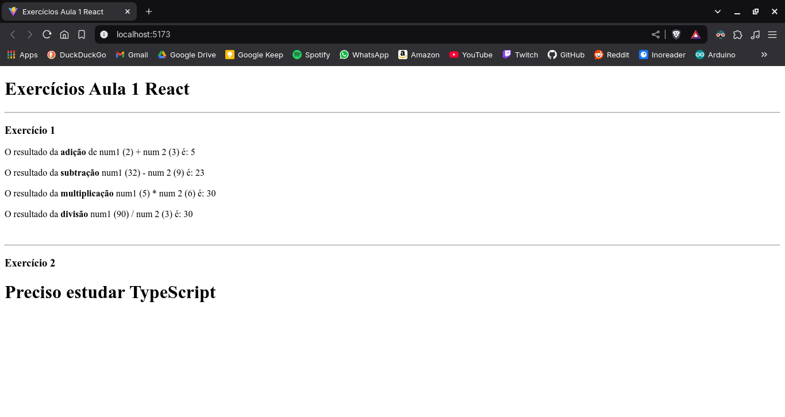

# Exercícios Aula 1 - React

Este projeto contém dois exercícios práticos utilizando React com Vite. O objetivo é criar e importar componentes filhos para o componente pai `App.jsx` para realizar operações matemáticas e exibir uma mensagem enviando dados através do *props* para os componentes filhos.

## Tecnologias Utilizadas

- Visual Studio Code
- Node.js
- NPM
- React
- Vite
- JavaScript (JSX)

## Exercícios  

### **Exercício 1:**

No React, criamos quatro componentes:

- **Adicao.jsx**
- **Subtracao.jsx**
- **Multiplicacao.jsx**
- **Divisao.jsx**

Cada um desses componentes recebe duas propriedades (`num1` e `num2`) e exibe a seguinte frase:

```
O resultado de num1 operação num2 é: resultado
```

**Exemplo de Uso:**

```jsx
<Adicao num1={2} num2={3}></Adicao>
<Subtracao num1={32} num2={9}></Subtracao>
<Multiplicacao num1={5} num2={6}></Multiplicacao>
<Divisao num1={90} num2={3}></Divisao>
```

### **Exercício 2:**

Criamos um componente chamado `PrecisoEstudar.jsx`, que recebe uma propriedade chamada `nomeDaTecnologia` e exibe a seguinte frase:

```
Preciso estudar NOME-DA-TECNOLOGIA
```

**Exemplo de Uso:**

```jsx
<PrecisoEstudar nomeDaTecnologia={"TypeScript"}></PrecisoEstudar>
```

## Resultado no Navegador



## Como Rodar o Projeto

1. Clone este repositório:

   ```bash
   git clone https://github.com/d4nkali/UNIESP_Front_End_Avancado_p4.git
   ```

2. Acesse a pasta do projeto:

   ```bash
   cd Exercicios/exercicios1
   ```

3. Instale as dependências:

   ```bash
   npm install
   ```

4. Inicie o servidor de desenvolvimento:

   ```bash
   npm run dev
   ```

5. Acesse no navegador:

   ```
   http://localhost:5173
   ```

## Estrutura do Projeto

```
exercicios1/
├─ README.md
├─ eslint.config.js
├─ img/
│  └─ resultado.png
├─ index.html
├─ package-lock.json
├─ package.json
├─ public/
│  └─ vite.svg
├─ src/
│  ├─ App.jsx
│  ├─ assets/
│  │  └─ react.svg
│  ├─ components/
│  │  ├─ Adicao.jsx
│  │  ├─ Divisao.jsx
│  │  ├─ Multiplicacao.jsx
│  │  ├─ PrecisoEstudar.jsx
│  │  └─ Subtracao.jsx
│  └─ main.jsx
└─ vite.config.js
```

## Autor

Desenvolvido por Danilo Pereira (@d4nkali)
