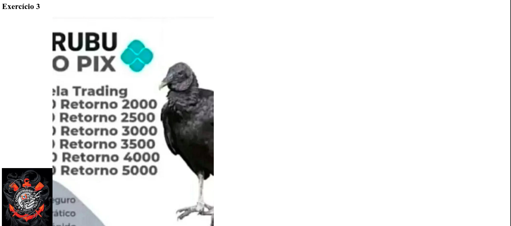

# Exercícios Aula 2 - React

Este projeto contém exercícios práticos utilizando React com Vite. O objetivo é criar e importar componentes filhos para o componente pai `App.jsx` e explorar funcionalidades como renderização condicional, manipulação de imagens e hooks do React.

## Tecnologias Utilizadas

- Visual Studio Code
- Node.js
- NPM
- React
- Vite
- JavaScript (JSX)

## Exercícios  

### **Exercício 1: Renderizando Com Funções**
Criamos um componente chamado `RenderizandoComFuncoes.jsx`, que possui uma função que decide renderizar um texto em `<h1>` ou `<h2>` dependendo do parâmetro passado.

### **Exercício 2: Renderiza Back ou Front**
Criamos um componente chamado `RenderizaBackOuFront.jsx`, que possui uma função que recebe uma linguagem como parâmetro e exibe se ela pertence ao Backend, Frontend ou Cloud.

### **Exercício 3: Trabalhando Com Imagens**
Criamos um componente chamado `TrabalhandoComImagens.jsx`, que carrega imagens estáticas e dinâmicas dentro da pasta `assets/` do projeto.

### **Exercício 4: Hook Contador**
Criamos um contador simples com o Hook `useState`. O componente `HookContador.jsx` permite incrementar e decrementar um valor ao clicar em botões.

### **Exercício 5: Hook Mega Sena**
Criamos um componente chamado `HookMegaSena.jsx`, que gera números aleatórios da Mega-Sena, garantindo que não haja repetição.

### **Exercício 6: Hook Quina**
Criamos um componente chamado `HookQuina.jsx`, que gera números aleatórios da Quina, garantindo que não haja repetição.

## Resultado no Navegador





## Como Rodar o Projeto

1. Clone este repositório:

   ```bash
   git clone https://github.com/d4nkali/UNIESP_Front_End_Avancado_p4.git
   ```

2. Acesse a pasta do projeto:

   ```bash
   cd Exercicios/exercicios2
   ```

3. Instale as dependências:

   ```bash
   npm install
   ```

4. Inicie o servidor de desenvolvimento:

   ```bash
   npm run dev
   ```

5. Acesse no navegador:

   ```
   http://localhost:5173
   ```

## Estrutura do Projeto

```
exercicios2/
├─ imgs/
│  ├─ captura-1.png
│  ├─ captura-2.png
│  └─ captura-3.png
├─ public/
│  ├─ image.png
│  └─ vite.svg
├─ src/
│  ├─ assets/
│  │  ├─ image.png
│  │  └─ react.svg
│  ├─ components/
│  │  ├─ HookContador.jsx
│  │  ├─ HookMegaSena.jsx
│  │  ├─ HookQuina.jsx
│  │  ├─ RenderizaBackOuFront.jsx
│  │  ├─ RenderizandoComFuncoes.jsx
│  │  └─ TrabalhandoComImagens.jsx
│  ├─ App.css
│  ├─ App.jsx
│  ├─ index.css
│  └─ main.jsx
├─ eslint.config.js
├─ index.html
├─ package-lock.json
├─ package.json
├─ README.md
└─ vite.config.js
```

## Autor

Desenvolvido por Danilo Pereira (@d4nkali)

