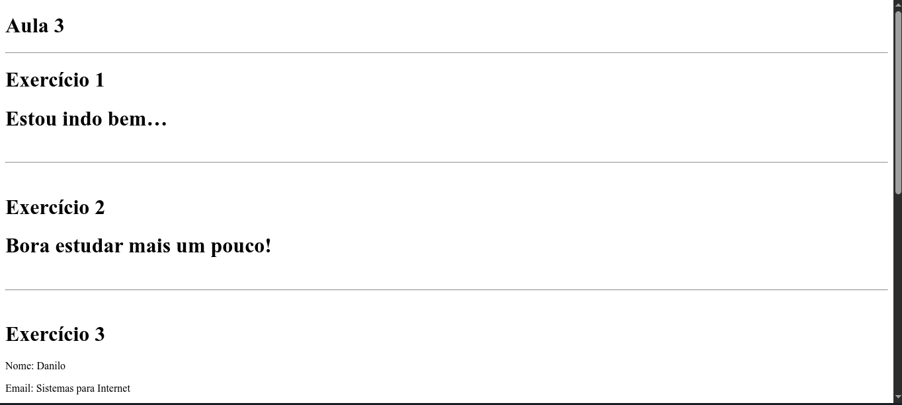
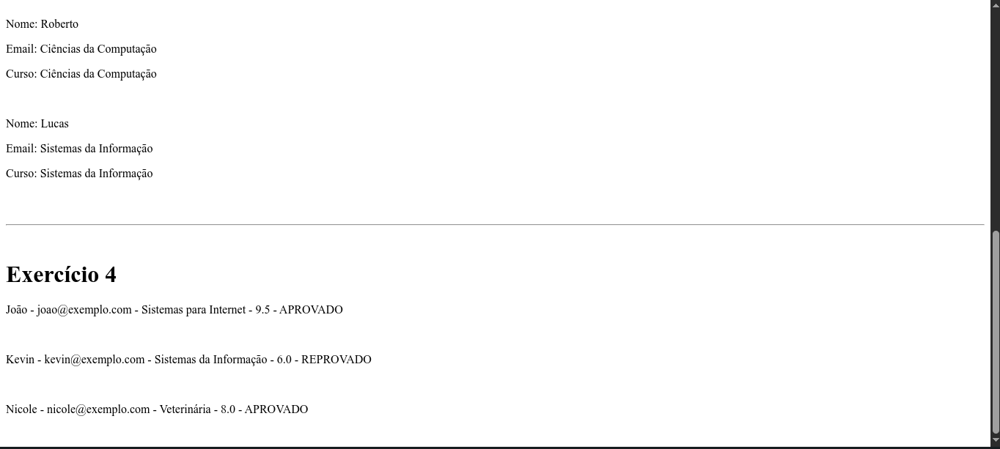

# Exercícios Aula 3 - React

Este projeto contém exercícios práticos utilizando React com Vite. O objetivo desta aula é praticar a criação de componentes, passar props para componentes filhos e realizar renderizações condicionais com base em valores booleanos e dados dinâmicos.

## Tecnologias Utilizadas

- Visual Studio Code  
- Node.js  
- NPM  
- React  
- Vite  
- JavaScript (JSX)

## Exercícios  

### **Exercício 1: Estou Conseguindo Aprender React**
Criamos um componente chamado `EstouConseguindoAprenderReact.jsx`, que recebe uma prop booleana chamada `estouConseguindo`. Com base no valor, renderiza uma mensagem indicando se o aluno está indo bem ou se precisa estudar mais.

### **Exercício 2: Está Com Sono**
Criamos um componente chamado `EstaComSono.jsx`, que também utiliza renderização condicional com base em uma prop chamada `comSono`. A mensagem varia entre "Hora de descansar" e "Bora estudar mais um pouco!".

### **Exercício 3: Lista de Alunos**
Criamos um componente chamado `Aluno.jsx`, que exibe informações como nome, email e curso dos alunos. Os dados são passados por meio de um array de objetos e renderizados dinamicamente usando `.map()`.

### **Exercício 4: Novo Aluno com Média**
Criamos o componente `NovoAluno.jsx`, que além das informações básicas, também exibe a média e o status do aluno (APROVADO ou REPROVADO), com base no valor da média (>= 7).

## Resultado no Navegador

  
  

## Como Rodar o Projeto

1. Clone este repositório:

   ```bash
   git clone https://github.com/d4nkali/UNIESP_Front_End_Avancado_p4.git
   ```

2. Acesse a pasta do projeto:

   ```bash
   cd Exercicios/exercicios3
   ```

3. Instale as dependências:

   ```bash
   npm install
   ```

4. Inicie o servidor de desenvolvimento:

   ```bash
   npm run dev
   ```

5. Acesse no navegador:

   ```
   http://localhost:5173
   ```

## Estrutura do Projeto

```
exercicios3/
├─ imgs/
│  ├─ image-1.png
│  └─ image-2.png
├─ public/
│  └─ vite.svg
├─ src/
│  ├─ assets/
│  │  └─ react.svg
│  ├─ components/
│  │  ├─ Aluno.jsx
│  │  ├─ EstaComSono.jsx
│  │  ├─ EstouConseguindoAprenderReact.jsx
│  │  └─ NovoAluno.jsx
│  ├─ App.css
│  ├─ App.jsx
│  ├─ index.css
│  └─ main.jsx
├─ eslint.config.js
├─ index.html
├─ package-lock.json
├─ package.json
├─ README.md
└─ vite.config.js

```

## Autor

Desenvolvido por Danilo Pereira [@d4nkali](https://github.com/d4nkali)
