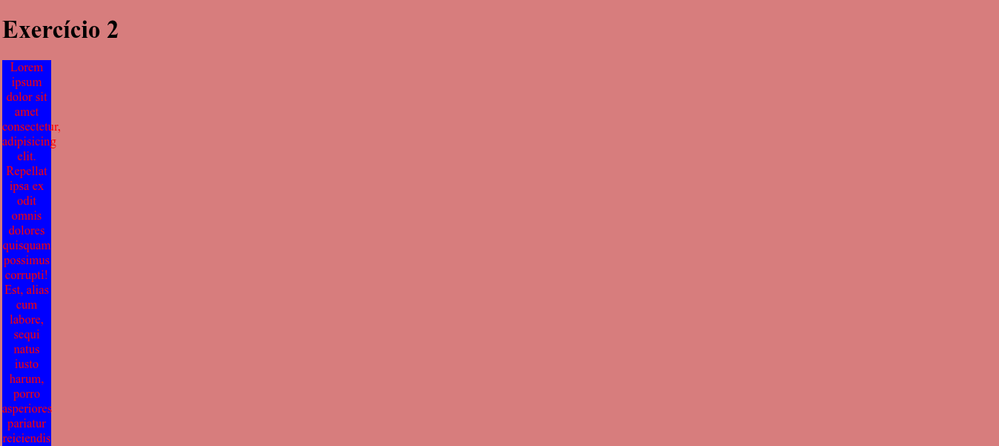

# Exercícios 4 - CSS no React

Este projeto contém exercícios práticos utilizando React com Vite. O objetivo é aplicar diferentes formas de estilização em componentes React, como CSS global, CSS inline, CSS modularizado e manipulação de formulários com conversão de dados em JSON.

## Tecnologias Utilizadas

* Visual Studio Code
* Node.js
* NPM
* React
* Vite
* JavaScript (JSX)
* CSS Modules

## Exercícios

### **Exercício 1: Estilo Global**

Foi criado um estilo global onde:

* A cor de fundo do `body` é `#d77d7d`;
* A fonte padrão tem tamanho `50px`;
* Todas as imagens possuem borda sólida de `1px` com a cor `#ccc`.

Além disso, foi criado um componente que renderiza um parágrafo `<p>` e uma imagem para verificar se os estilos globais foram aplicados corretamente.

### **Exercício 2: Estilo Inline**

Foi desenvolvido um componente com estilo inline diretamente aplicado ao elemento, com as seguintes configurações:

* Cor do texto: vermelha (`#ff0000`);
* Cor de fundo: azul (`#0000ff`);
* Largura: `200px`;
* Alinhamento centralizado.

### **Exercício 3: CSS Modularizado - Campanha**

Foi criado um componente chamado `Campanha.jsx` com estilo modularizado. Esse componente recebe o mês como prop e exibe uma mensagem temática com cores diferentes:

* **Setembro** → fundo amarelo, texto: "Prevenção ao suicídio".
* **Outubro** → fundo rosa, texto: "Conscientização sobre o câncer de mama".
* **Novembro** → fundo azul, texto: "Prevenção e combate ao câncer de próstata".

A mensagem é renderizada dentro de uma tarja estilizada conforme o mês.

### **Exercício 4: Formulário de Contato**

Criado um componente `FormularioDeContato.jsx` que contém:

* Campos de entrada: Nome, Contato e Mensagem.
* Ao submeter o formulário, os dados são organizados em um objeto literal e convertidos para JSON usando `JSON.stringify`.
* É exibida no console a mensagem:

  ```
  O seguinte JSON será enviado via HTTP POST para o back-end: {conteúdo do JSON}
  ```

## Resultado no Navegador





## Como Rodar o Projeto

1. Clone este repositório:

   ```bash
   git clone https://github.com/d4nkali/UNIESP_Front_End_Avancado_p4.git
   ```

2. Acesse a pasta do projeto:

   ```bash
   cd Exercicios/exercicios3
   ```

3. Instale as dependências:

   ```bash
   npm install
   ```

4. Inicie o servidor de desenvolvimento:

   ```bash
   npm run dev
   ```

5. Acesse no navegador:

   ```
   http://localhost:5173
   ```

## Estrutura do Projeto

```
exercicios4/
├─ public/
│  ├─ images.jpeg
│  └─ vite.svg
├─ src/
│  ├─ assets/
│  │  └─ react.svg
│  ├─ components/
│  │  ├─ Campanha.jsx
│  │  ├─ Campanha.module.css
│  │  ├─ EstiloGlobal.jsx
│  │  ├─ EstiloInline.jsx
│  │  └─ FormularioDeContato.jsx
│  ├─ App.css
│  ├─ App.jsx
│  ├─ index.css
│  └─ main.jsx
├─ Aula 04.pdf
├─ eslint.config.js
├─ index.html
├─ package-lock.json
├─ package.json
├─ README.md
└─ vite.config.js
```

## Autor

Desenvolvido por Danilo Pereira (@d4nkali)
