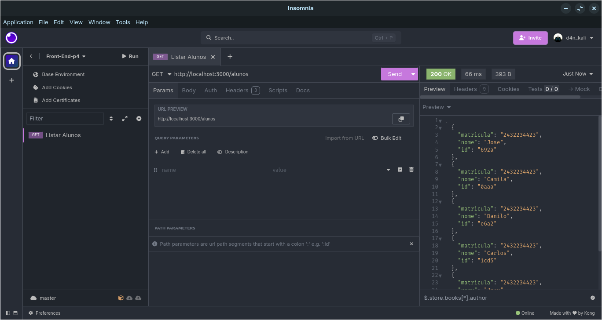
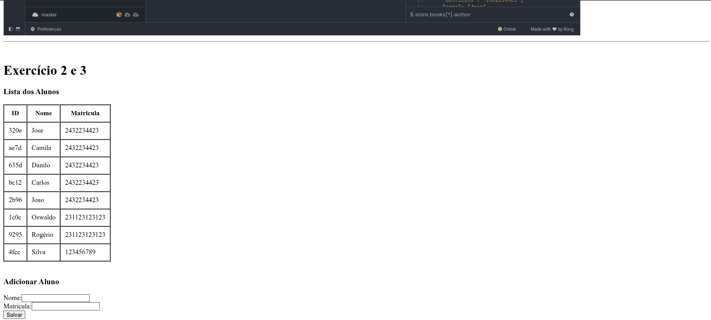

# Exercícios 5 - JSON Server

Este projeto consiste em uma aplicação React que interage com uma API fake criada com o [JSON Server](https://github.com/typicode/json-server), simulando operações básicas de uma API RESTful, como GET e POST, com o objetivo de praticar conceitos de requisições HTTP e manipulação de dados em interfaces web.

---

## Objetivos dos Exercícios

### Exercício 1: Criar uma API fake com JSON Server

- Criar uma API RESTful fake que retorna uma lista de alunos.
- Cada aluno deve possuir:
  - `nome`
  - `email`
  - `curso`
- Utilizar um cliente HTTP (como Insomnia ou Postman) para fazer um GET e visualizar os dados.

Exemplo do resultado no Insomnia:


---

### Exercício 2: Exibir os dados da API

- Criar uma interface em React que consome a API criada.
- Os dados dos alunos devem ser exibidos organizadamente em uma tabela HTML.

---

### Exercício 3: Adicionar novos alunos

- Adicionar um formulário que permite o cadastro de novos alunos.
- Ao enviar o formulário, a lista de alunos deve ser atualizada automaticamente sem recarregar a página.
- A tabela e o formulário devem estar na mesma página.

---

### Resultado no Navegado Exercícios 2 e 3



---

## Tecnologias Utilizadas

- Visual Studio Code  
- Node.js  
- NPM  
- React  
- Vite  
- JavaScript (JSX)
- JSON Server

---

## Como executar o projeto

### 1. Clone o repositório

```bash
git clone https://github.com/seu-usuario/seu-repo.git
cd seu-repo/Exercicios/exercicios5
```

### 2. Instale as dependências do projeto React

```bash
npm install
```

### 3. Inicie o JSON Server

Você precisa de um arquivo `db.json` com a estrutura dos alunos. Exemplo:

```json
{
  "alunos": [
    {
      "id": 1,
      "nome": "Maria da Silva",
      "matricula": "12345"
    }
  ]
}
```

E então execute o servidor:

```bash
npx json-server --watch db.json --port 3000
```

### 4. Inicie o projeto React

Em outro terminal:

```bash
npm run dev
```

---

## Estrutura dos Arquivos

```
exercicios5/
├─ data/
│  └─ db.json
├─ imgs/
│  ├─ image-1.png
│  └─ image-2.png
├─ public/
│  ├─ exercicio-1.png
│  └─ vite.svg
├─ src/
│  ├─ assets/
│  │  └─ react.svg
│  ├─ components/
│  │  └─ ListarAlunos.jsx
│  ├─ App.css
│  ├─ App.jsx
│  ├─ index.css
│  └─ main.jsx
├─ Aula 05.pdf
├─ eslint.config.js
├─ index.html
├─ package-lock.json
├─ package.json
├─ README.md
└─ vite.config.js
```

---

## Autor

**Danilo Pereira** – [@d4nkali](https://github.com/d4nkali)